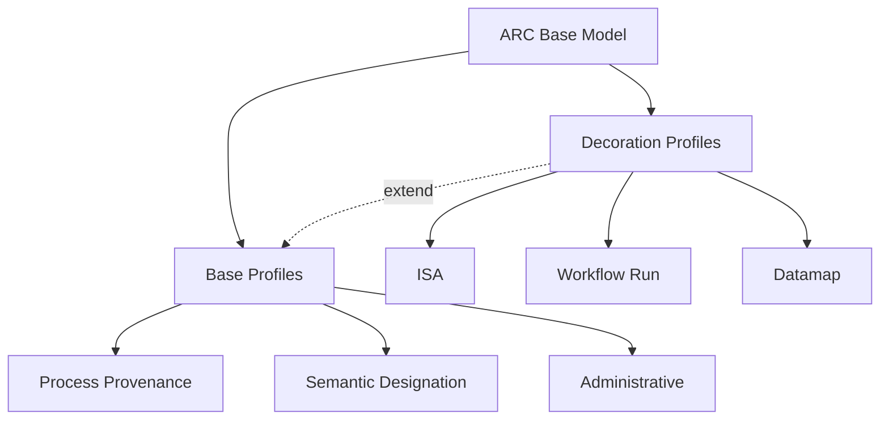

# ARC Base Model

Specification and implementation workspace for the ARC Base Model. The model is
organized into three base profiles—Process Provenance, Semantic Designation,
and Administrative—and domain-specific decoration profiles that extend them.
The repository also contains derived schema representations, examples, and F#
libraries for working across .NET, JavaScript, and Python runtimes.

## Start Here

- [Project overview](project/overview.md)
- [Base profiles](spec/index.md)
- [Decoration profiles](spec/decorations/overview.md)
- [Specification guide](project/specification.md)
- [Implementation guide](project/implementation.md)
- [ProcessCore implementation guide](core-implementation/overview.md)
- [Examples and schemas](project/examples-and-schemas.md)
- [Reference material](project/references.md)
- [Prior art notes](project/prior-art.md)

## Profile Overview

