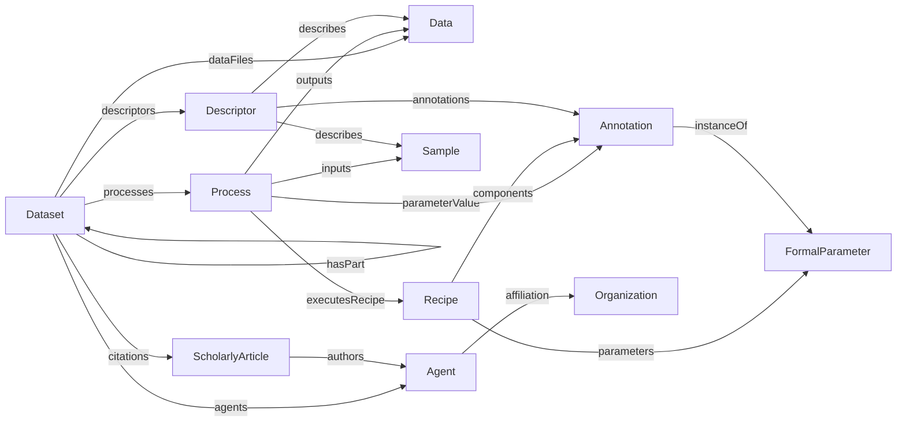

# Specification Guide

The normative specification lives in [docs/spec](../spec/index.md). The repository organizes the ARC RDM model into three base profiles: Process Provenance, Semantic Designation, and Administrative. Decoration profiles, including Datamap, add domain-specific refinements. The implementation remains one shared model; profile boundaries are documentation and mapping boundaries, not runtime type boundaries.

## Base Profiles

Shared model entities:

| Entity | Source |
|--------|--------|
| Dataset | [Process Provenance](../spec/process_provenance/Dataset.md), [Semantic Designation](../spec/semantic_designation/Dataset.md), [Administrative](../spec/administrative/Dataset.md) |
| Process | [Process](../spec/process_provenance/Process.md) |
| Recipe | [Recipe](../spec/process_provenance/Recipe.md) |
| Sample | [Sample](../spec/shared/Sample.md) |
| Data | [Data](../spec/shared/Data.md) |
| Descriptor | [Descriptor](../spec/semantic_designation/Descriptor.md) |
| Annotation | [Annotation](../spec/shared/Annotation.md) |
| FormalParameter | [FormalParameter](../spec/process_provenance/FormalParameter.md) |
| DefinedTerm | [DefinedTerm](../spec/shared/DefinedTerm.md) |
| DefinedTermSet | [DefinedTermSet](../spec/shared/DefinedTermSet.md) |
| Agent | [Agent](../spec/administrative/Agent.md) |
| Organization | [Organization](../spec/administrative/Organization.md) |
| ScholarlyArticle | [ScholarlyArticle](../spec/administrative/ScholarlyArticle.md) |

Base profile entry points:

| Base Profile | Purpose | Source |
|--------------|---------|--------|
| Process Provenance | Provenance through datasets, processes, protocols, samples, data, and annotations | [Process Provenance](../spec/process_provenance/overview.md) |
| Semantic Designation | Semantic descriptions that connect datasets, samples, and data with bundled annotations | [Semantic Designation](../spec/semantic_designation/overview.md) |
| Administrative | Dataset metadata, agents, affiliations, citations, licenses, and dates | [Administrative](../spec/administrative/overview.md) |

## Decorations

Decorations add domain-specific meaning through `additionalType`, specialized properties, and decoration-specific entities.

| Decoration | Purpose | Source |
|------------|---------|--------|
| ISA | Investigation, Study, Assay, Source, Sample, and ISA property value roles | [ISA](../spec/decorations/isa/overview.md) |
| Workflow Run | Workflow and Run datasets, workflow protocols, and workflow invocations | [Workflow Run](../spec/decorations/workflow-run/overview.md) |
| Datamap | Data files, selected fragments, and DataContext descriptors | [Datamap](../spec/decorations/datamap/overview.md) |

## Naming Notes

The Process Provenance vocabulary uses `Process` and `Recipe`, not the older placeholder names `Process` and `Protocol`.

For process I/O, the current core and YAML schema names are:

- `inputs`
- `outputs`
- `executesRecipe`
- `parameterValue`
- `additionalProperty`

Some legacy/profile-shaped examples and upstream references use RO-Crate or Bioschemas names such as `object` and `result`. See [Examples and schemas](examples-and-schemas.md) for how those files are treated.

## Querying

The query use cases are described in [Querying](querying.md). The implementation exposes `Path` as a returned value object, while traversal and query operations are attached to the model types in `src/ProcessCore/Graph.fs`.

