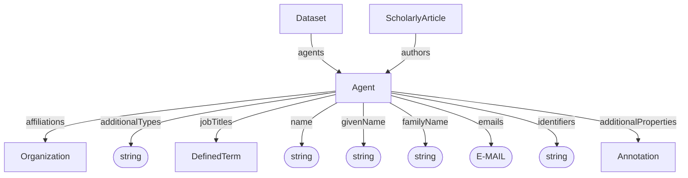

# Agent

A person or agentic software system associated with a dataset or citation, for example as a contributor, author, or contact.

The domain discriminator remains `type: Agent` regardless of the kind of agent represented.

## Properties

| Property | Type | Cardinality | Required | Description |
|----------|------|-------------|----------|-------------|
| `id` | Text | `0..1` | MAY | Optional identifier within an application-defined scope. Implementations that require an internal identifier SHOULD use this field. The domain model does not automatically assign identifiers. |
| `type` | Text | `1` | MUST | `Agent` |
| `additionalTypes` | Text | `0..*` | MAY | Discriminator for decoration types. |
| `name` | Text | `1` | MUST | Human-readable name of the agent. For a real person, this SHOULD combine the available `givenName` and `familyName` components where possible. For a software agent, this is the name by which the software system is known. |
| `givenName` | Text | `0..1` | MAY | Given name of a person, where applicable. |
| `familyName` | Text | `0..1` | MAY | Family name of a person, where applicable. |
| `emails` | Text | `0..*` | SHOULD | Email addresses through which the person or software agent can be contacted. This field SHOULD be provided where applicable. |
| `affiliations` | [Organization](Organization.md) | `0..*` | SHOULD | Organizations with which the agent is affiliated, where applicable. For a person, these may include employers or research institutions. A software agent's creator, provider, or operator does not automatically constitute an affiliation. This field SHOULD be provided where an affiliation applies. |
| `identifiers` | Text | `0..*` | SHOULD | Identifiers by which the agent is known or referenced, such as an ORCID for a person or an identifier assigned to a software agent by a registry or application. Identifiers may be globally scoped or scoped to a particular system or context. |
| `additionalProperties` | [Annotation](../shared/Annotation.md) | `0..*` | MAY | Extensible metadata about the person or software agent that is not covered by the base properties. |
| `jobTitles` | [DefinedTerm](../shared/DefinedTerm.md) | `0..*` | MAY | Titles describing the agent's occupation, role, or function. For a person, these may be professional titles such as researcher or data steward. For a software agent, these may describe its function, such as automated annotator or data analysis assistant. |

## Relationships

