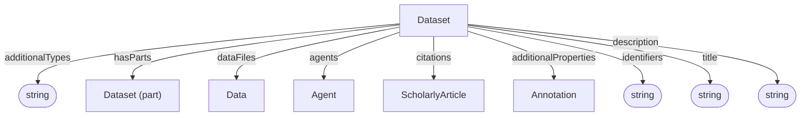

# Dataset

Container and context for data, and administrative metadata. 

**Schema.org type**: [`schema.org/Dataset`](https://schema.org/Dataset)

Decorations specialize Dataset via `additionalTypes`:
- ISA: Investigation, Study, Assay
- Workflow Run: ARC Workflow, ARC Run
- Datamap

## Properties

Recommended property mappings are documented in the [schema mapping guide](../../project/schema-mapping.md#administrative).

| Property | Type | Cardinality | Required | Description |
|----------|------|-------------|----------|-------------|
| `id` | Text | `0..1` |  MAY | Optional identifier within an application-defined scope. Implementations that require an internal identifier SHOULD use this field. The domain model does not automatically assign identifiers. |
| `type` | Text | `1` | MUST | `Dataset` |
| `additionalTypes` | Text | `1..*` | MUST | MUST include `administrative` as its [base-profile discriminator](../index.md#profile-discriminators). Additional classifications and decoration types MAY also be included. |
| `identifiers` | Text | `1..*` | MUST | Identifiers by which the dataset is known or referenced, such as a DOI, accession number, repository name, or other identifying string. Identifiers may be globally scoped or scoped to a particular system or context. |
| `title` | Text | `0..1` | SHOULD | Human-readable dataset title |
| `description` | Text | `0..1` | SHOULD | Short description or abstract |
| `license` | Text | `0..1` | MAY | License identifier, URL, or label |
| `datePublished` | Text | `0..1` | MAY | Publication date |
| `dateCreated` | Text | `0..1` | MAY | Creation date |
| `dateModified` | Text | `0..1` | MAY | Modification date |
| `hasParts` | [Dataset](../index.md#dataset-nesting) | `0..*` | SHOULD | Contained datasets from any base profile. Each child declares its own profile, independently of its parent and siblings; the same nesting options apply at every depth. |
| `dataFiles` | [Data](../shared/Data.md) | `0..*` | MAY | Data files that belong to this dataset |
| `agents` | [Agent](../administrative/Agent.md) | `0..*` | MAY | Dataset agents |
| `citations` | [ScholarlyArticle](../administrative/ScholarlyArticle.md) | `0..*` | MAY | Publications cited by or associated with the dataset |
| `additionalProperties` | [Annotation](../process_provenance/Annotation.md) | `0..*` | MAY | Extensible metadata |

## Relationships

