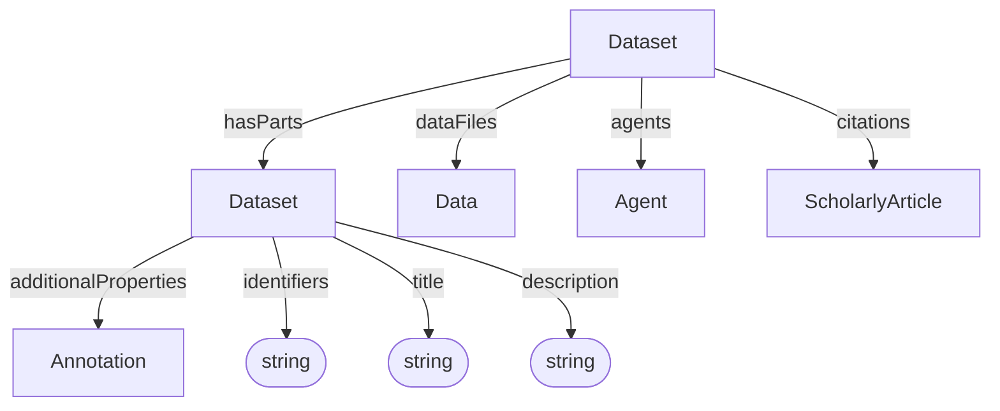

# Dataset

Container and context for data, and administrative metadata. 

**Schema.org type**: [`schema.org/Dataset`](https://schema.org/Dataset)

Decorations specialize Dataset via `additionalTypes`:
- ISA: Investigation, Study, Assay
- Workflow Run: ARC Workflow, ARC Run
- Datamap

## Properties

| Property | Type | Cardinality | Required | Description | Recommended Schema.org mapping |
|----------|------|-------------|----------|-------------|--------------------------------|
| `id` | Text | `0..1` |  MAY | Optional identifier within an application-defined scope. Implementations that require an internal identifier SHOULD use this field. The domain model does not automatically assign identifiers. | None |
| `type` | Text | `1` | MUST | `Dataset` | None |
| `additionalTypes` | Text | `0..*` | MAY | Additional classifications or specializations of the dataset. Discriminator used for decoration types. | [`additionalType`](https://schema.org/additionalType) |
| `identifiers` | Text | `1..*` | MUST | Identifiers by which the dataset is known or referenced, such as a DOI, accession number, repository name, or other identifying string. Identifiers may be globally scoped or scoped to a particular system or context. | [`identifier`](https://schema.org/identifier) |
| `title` | Text | `0..1` | SHOULD | Human-readable dataset title | [`name`](https://schema.org/name) |
| `description` | Text | `0..1` | SHOULD | Short description or abstract | [`description`](https://schema.org/description) |
| `license` | Text | `0..1` | MAY | License identifier, URL, or label | [`license`](https://schema.org/license) |
| `datePublished` | Text | `0..1` | MAY | Publication date | [`datePublished`](https://schema.org/datePublished) |
| `dateCreated` | Text | `0..1` | MAY | Creation date | [`dateCreated`](https://schema.org/dateCreated) |
| `dateModified` | Text | `0..1` | MAY | Modification date | [`dateModified`](https://schema.org/dateModified) |
| `hasParts` | [Dataset](Dataset.md) | `0..*` | SHOULD | Sub-datasets | [`hasPart`](https://schema.org/hasPart) |
| `dataFiles` | [Data](../process_provenance/Data.md) | `0..*` | MAY | Data files that belong to this dataset | [`hasPart`](https://schema.org/hasPart) |
| `agents` | [Agent](../administrative/Agent.md) | `0..*` | MAY | Dataset agents | [`creator`](https://schema.org/creator)   more specific mappings may depend on the agents’ roles and the target profile.|
| `citations` | [ScholarlyArticle](../administrative/ScholarlyArticle.md) | `0..*` | MAY | Publications cited by or associated with the dataset | [`citation`](https://schema.org/citation) |
| `additionalProperties` | [Annotation](../process_provenance/Annotation.md) | `0..*` | MAY | Extensible metadata | [`additionalProperty`](https://schema.org/additionalProperty) |

## Relationships

