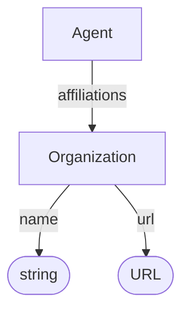

# Organization

Entity representing an organization involved in creating, curating, hosting, or publishing a dataset.

**Schema.org type**: [`schema.org/Organization`](https://schema.org/Organization)

## Properties

| Property | Type | Cardinality | Required | Description | Recommended Schema.org mapping |
|----------|------|-------------|----------|-------------|--------------------------------|
| `id` | Text | `0..1` | MAY | Optional identifier within an application-defined scope. Implementations that require an internal identifier SHOULD use this field. The domain model does not automatically assign identifiers. | None |
| `type` | Text | `1` | MUST | `Organization` | None |
| `name` | Text | `1` | MUST | Human-readable name of the organization | [`name`](https://schema.org/name) |
| `url` | URL | `0..1` | MAY | Organization website or identifier URL | [`url`](https://schema.org/url) |

## Relationships

