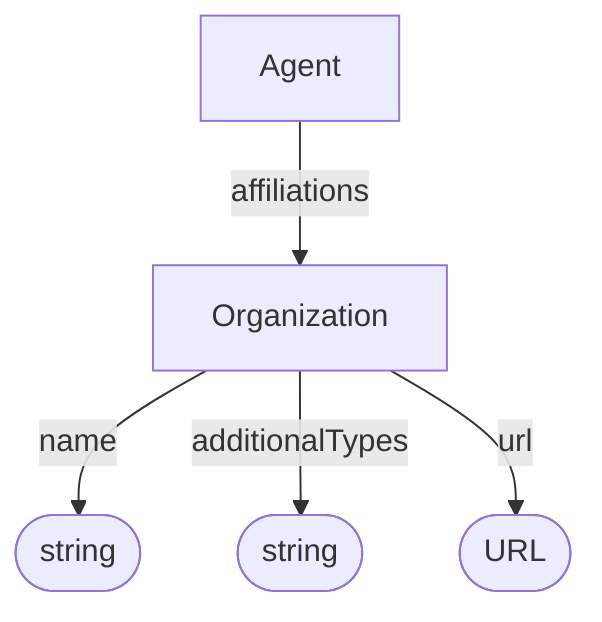

# Organization

Entity representing an organization involved in creating, curating, hosting, or publishing a dataset.

## Properties

| Property | Type | Cardinality | Required | Description |
|----------|------|-------------|----------|-------------|
| `id` | Text | `0..1` | MAY | Optional identifier within an application-defined scope. Implementations that require an internal identifier SHOULD use this field. The domain model does not automatically assign identifiers. |
| `type` | Text | `1` | MUST | `Organization` |
| `additionalTypes` | Text | `0..*` | MAY | Discriminator for decoration types. |
| `name` | Text | `1` | MUST | Human-readable name of the organization |
| `url` | URL | `0..1` | MAY | Organization website or identifier URL |

## Relationships

