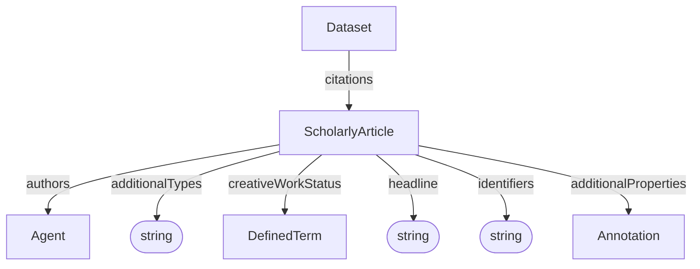

# ScholarlyArticle

A scholarly publication associated with a Dataset. This can be used to link to publications describing the experiment, method, or results.

## Properties

| Property | Type | Cardinality | Required | Description |
|----------|------|-------------|----------|-------------|
| `id` | Text | `0..1` | MAY | Optional identifier within an application-defined scope. Implementations that require an internal identifier SHOULD use this field. The domain model does not automatically assign identifiers. |
| `type` | Text | `1` | MUST | `ScholarlyArticle` |
| `additionalTypes` | Text | `0..*` | MAY | Discriminator for decoration types. |
| `headline` | Text | `1` | MUST | Human-readable title of the article |
| `identifiers` | Text | `0..*` | SHOULD | Identifiers by which the article is known or referenced, such as a DOI, PubMed ID, or repository identifier. Identifiers may be globally scoped or scoped to a particular system or context. |
| `authors` | [Agent](Agent.md) | `0..*` | SHOULD | Agents credited as authors of the article. These may be people or agentic software systems. |
| `creativeWorkStatus` | [DefinedTerm](../shared/DefinedTerm.md) | `0..1` | MAY | Stage of the article in its publication lifecycle, such as Draft or Published. |
| `additionalProperties` | [Annotation](../shared/Annotation.md) | `0..*` | MAY | Extensible article metadata not covered by the base properties. |

## Relationships

