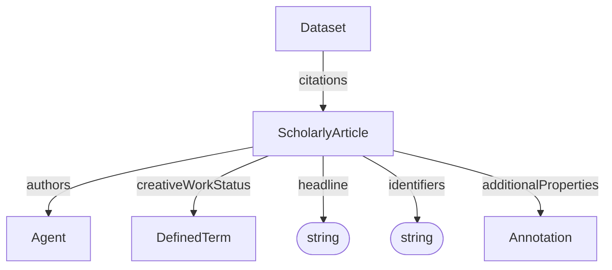

# ScholarlyArticle

A scholarly publication associated with a Dataset. This can be used to link to publications describing the experiment, method, or results.

**Schema.org type**: [`schema.org/ScholarlyArticle`](https://schema.org/ScholarlyArticle)

## Properties

| Property | Type | Cardinality | Required | Description | Recommended Schema.org mapping |
|----------|------|-------------|----------|-------------|--------------------------------|
| `id` | Text | `0..1` | MAY | Optional identifier within an application-defined scope. Implementations that require an internal identifier SHOULD use this field. The domain model does not automatically assign identifiers. | None |
| `type` | Text | `1` | MUST | `ScholarlyArticle` | None |
| `headline` | Text | `1` | MUST | Human-readable title of the article | [`headline`](https://schema.org/headline) |
| `identifiers` | Text | `0..*` | SHOULD | Identifiers by which the article is known or referenced, such as a DOI, PubMed ID, or repository identifier. Identifiers may be globally scoped or scoped to a particular system or context. | [`identifier`](https://schema.org/identifier) |
| `authors` | [Agent](Agent.md) | `0..*` | SHOULD | Agents credited as authors of the article. These may be people or agentic software systems. | [`author`](https://schema.org/author) for people; software-agent mappings depend on the target profile. |
| `creativeWorkStatus` | [DefinedTerm](../process_provenance/DefinedTerm.md) | `0..1` | MAY | Stage of the article in its publication lifecycle, such as Draft or Published. | [`creativeWorkStatus`](https://schema.org/creativeWorkStatus) |
| `additionalProperties` | [Annotation](../process_provenance/Annotation.md) | `0..*` | MAY | Extensible article metadata not covered by the base properties. | [`additionalProperty`](https://schema.org/additionalProperty) as a profile convention; specific mappings may depend on the target profile. |

## Relationships

