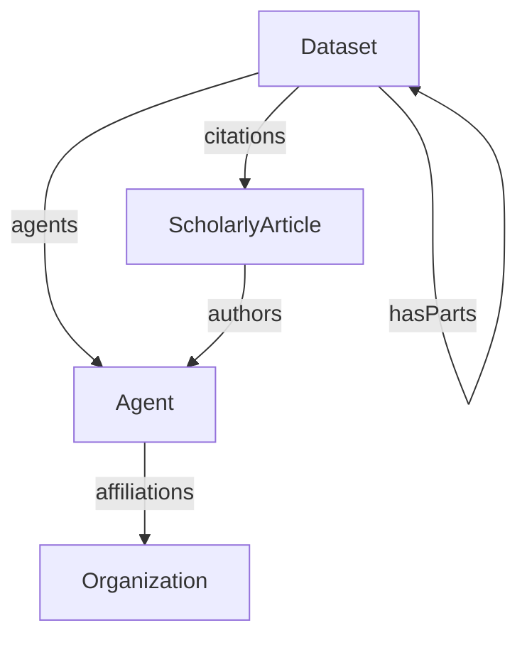

# Administrative

The Administrative profile describes dataset-level administrative provenance: identifying metadata, agents and contributors, affiliations, citations, rights information, and lifecycle dates.

## Entity Specifications

| Type | Description |
|------|-------------|
| [Dataset](Dataset.md) | Container for data and administrative metadata, including identifiers, rights, lifecycle dates, agents, and citations |
| [Agent](Agent.md) | Person or agentic software system associated with a dataset or publication |
| [Organization](Organization.md) | Organization with which an agent is affiliated |
| [ScholarlyArticle](ScholarlyArticle.md) | Scholarly publication associated with a dataset |

Administrative properties such as `license`, `datePublished`, `dateCreated`, `dateModified`, `agents`, and `citations` are typed properties on the [Dataset](Dataset.md) type.

## Relationships

The diagram shows the administrative entities and their main relationships.

