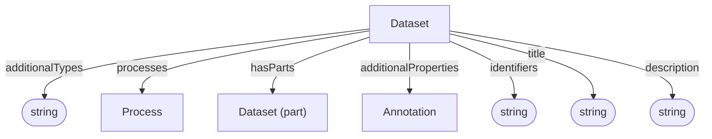

# Dataset

Container and context for data and processes. This is the same Dataset type described by the [Administrative profile](../administrative/Dataset.md), which also defines `dataFiles` and administrative metadata.

## Properties

| Property | Type | Cardinality | Required | Description |
|----------|------|-------------|----------|-------------|
| `id` | Text | `0..1` | MAY | Optional identifier within an application-defined scope. Implementations that require an internal identifier SHOULD use this field. The domain model does not automatically assign identifiers. |
| `type` | Text | `1` | MUST | `Dataset` |
| `additionalTypes` | Text | `0..*` | MAY | Discriminator for decoration types. |
| `conformsTos` | Text | `1..*` | MUST | MUST include `process-provenance` as its [base-profile discriminator](../index.md#profile-discriminators). Additional classifications or specializations MAY also be included. |
| `identifiers` | Text | `1..*` | MUST | Identifiers by which the dataset is known or referenced, such as a DOI, accession number, repository name, or other identifying string. Identifiers may be globally scoped or scoped to a particular system or context. |
| `title` | Text | `0..1` | SHOULD | Human-readable dataset title |
| `description` | Text | `0..1` | SHOULD | Short description or abstract |
| `processes` | [Process](Process.md) | `0..*` | SHOULD | Processes contained in this dataset |
| `hasParts` | [Dataset](../index.md#dataset-nesting) | `0..*` | SHOULD | Contained datasets from any base profile. Each child declares its own profile, independently of its parent and siblings; the same nesting options apply at every depth. |
| `additionalProperties` | [Annotation](../shared/Annotation.md) | `0..*` | MAY | Extensible metadata |

## Relationships

