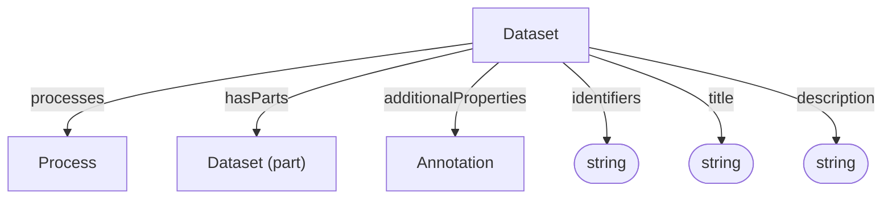

# Dataset

Container and context for data and processes. This is the same Dataset type described by the [Administrative profile](../administrative/Dataset.md), which also defines `dataFiles` and administrative metadata.

**Schema.org type**: [`schema.org/Dataset`](https://schema.org/Dataset)

Decorations specialize Dataset via `additionalTypes`:
- ISA: Investigation, Study, Assay
- Workflow Run: ARC Workflow, ARC Run
- Datamap

## Properties

| Property | Type | Cardinality | Required | Description | Recommended Schema.org mapping |
|----------|------|-------------|----------|-------------|--------------------------------|
| `id` | Text | `0..1` | MAY | Optional identifier within an application-defined scope. Implementations that require an internal identifier SHOULD use this field. The domain model does not automatically assign identifiers. | None |
| `type` | Text | `1` | MUST | `Dataset` | None |
| `additionalTypes` | Text | `0..*` | MAY | Additional classifications or specializations of the dataset. Discriminator used for decoration types. | [`additionalType`](https://schema.org/additionalType) |
| `identifiers` | Text | `1..*` | MUST | Identifiers by which the dataset is known or referenced, such as a DOI, accession number, repository name, or other identifying string. Identifiers may be globally scoped or scoped to a particular system or context. | [`identifier`](https://schema.org/identifier) |
| `title` | Text | `0..1` | SHOULD | Human-readable dataset title | [`name`](https://schema.org/name) |
| `description` | Text | `0..1` | SHOULD | Short description or abstract | [`description`](https://schema.org/description) |
| `processes` | [Process](Process.md) | `0..*` | SHOULD | Processes contained in this dataset | [`about`](https://schema.org/about) |
| `hasParts` | [Dataset](Dataset.md) | `0..*` | SHOULD | Sub-datasets | [`hasPart`](https://schema.org/hasPart) |
| `additionalProperties` | [Annotation](Annotation.md) | `0..*` | MAY | Extensible metadata | [`additionalProperty`](https://schema.org/additionalProperty) as a profile convention; specific mappings may depend on the target profile. |

## Relationships

