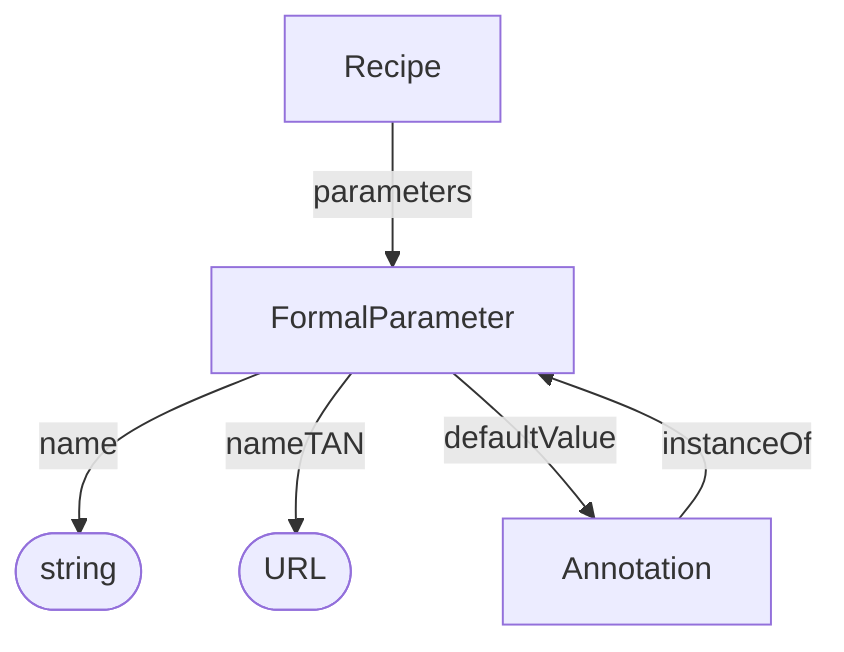

# FormalParameter

A prospective parameter slot in a recipe. Parameter-value annotations can refer to this definition through `instanceOf`.

**Bioschemas type**: [`FormalParameter`](https://bioschemas.org/types/FormalParameter/1.0-RELEASE)

## Properties

Recommended property mappings are documented in the [schema mapping guide](../../project/schema-mapping.md#process-provenance).

| Property | Type | Cardinality | Required | Description |
|----------|------|-------------|----------|-------------|
| `id` | Text | `0..1` | MAY | Optional identifier within an application-defined scope. Implementations that require an internal identifier SHOULD use this field. The domain model does not automatically assign identifiers. |
| `type` | Text | `1` | MUST | `FormalParameter` |
| `name` | Text | `0..1` | SHOULD | Human-readable name of the parameter slot (should match the workflow parameter) |
| `nameTAN` | URL | `0..1` | SHOULD | URL of the ontology term used for the parameter's key. TAN stands for term accession number. |
| `defaultValue` | [Annotation](Annotation.md) | `0..1` | MAY | Default value for the parameter, represented as an annotation with an optional unit and ontology term references |

## Relationships

