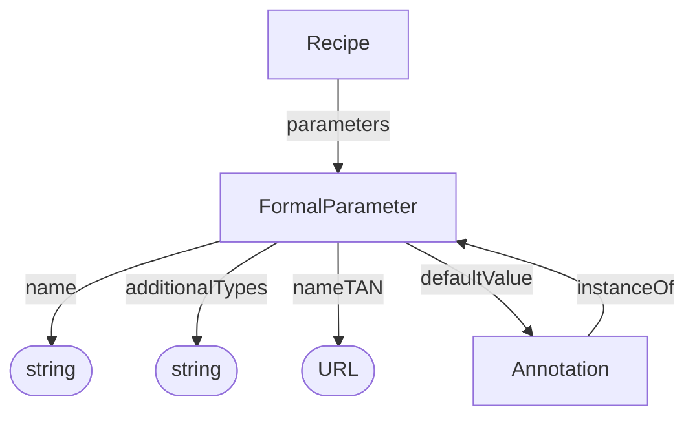

# FormalParameter

A prospective parameter slot in a recipe. Parameter-value annotations can refer to this definition through `instanceOf`.

## Properties

| Property | Type | Cardinality | Required | Description |
|----------|------|-------------|----------|-------------|
| `id` | Text | `0..1` | MAY | Optional identifier within an application-defined scope. Implementations that require an internal identifier SHOULD use this field. The domain model does not automatically assign identifiers. |
| `type` | Text | `1` | MUST | `FormalParameter` |
| `additionalTypes` | Text | `1..*` | MUST | MUST include `process-provenance` as its [base-profile discriminator](../index.md#profile-discriminators). Additional classifications or specializations MAY also be included. |
| `name` | Text | `0..1` | SHOULD | Human-readable name of the parameter slot |
| `nameTAN` | URL | `0..1` | SHOULD | URL of the ontology term used for the parameter's key. TAN stands for term accession number. |
| `defaultValue` | [Annotation](../shared/Annotation.md) | `0..1` | MAY | Default value for the parameter, represented as an annotation with an optional unit and ontology term references |

## Relationships

