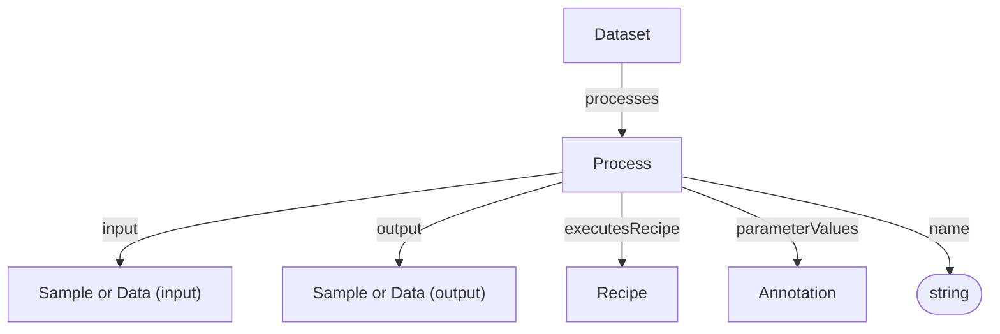
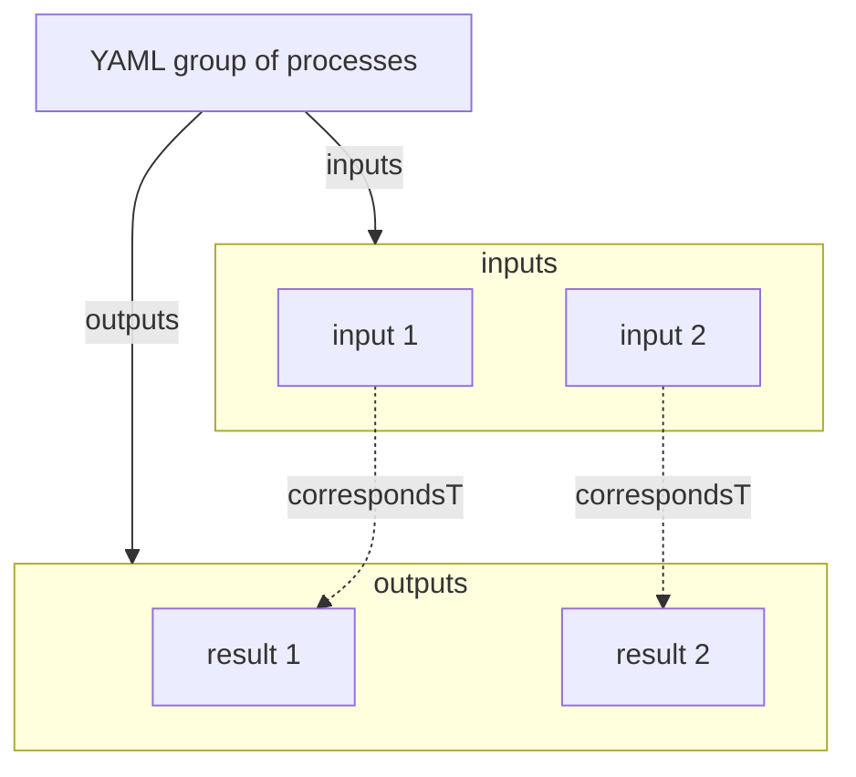

# Process

Core transformation in the process graph. A Process connects an optional input to an optional output and can reference the Recipe that was executed.

**Bioschemas type**: [`LabProcess`](https://bioschemas.org/types/LabProcess/0.1-DRAFT)

Decorations specialize Process via `additionalTypes`:
- ISA: Process
- Workflow Run: Workflow Invocation (CreateAction + Process)

## Properties

Recommended property mappings are documented in the [schema mapping guide](../../project/schema-mapping.md#process-provenance).

| Property | Type | Cardinality | Required | Description |
|----------|------|-------------|----------|-------------|
| `id` | Text | `0..1` | MAY | Optional identifier within an application-defined scope. Implementations that require an internal identifier SHOULD use this field. The domain model does not automatically assign identifiers. |
| `type` | Text | `1` | MUST | `Process` |
| `additionalTypes` | Text | `0..*` | MAY | Additional classifications or specializations of the process. Discriminator used for decoration types. |
| `name` | Text | `1` | MUST | Human-readable name of the process |
| `input` | [Sample](Sample.md), [Data](Data.md) | `0..1` | SHOULD | Sample or data object used as the input of this process |
| `output` | [Sample](Sample.md), [Data](Data.md) | `0..1` | SHOULD | Sample or data object produced as the output of this process |
| `executesRecipe` | [Recipe](Recipe.md) | `0..1` | SHOULD | Recipe executed by this process |
| `parameterValues` | [Annotation](Annotation.md) | `0..*` | SHOULD | Parameter annotations describing values used in this process |

## Relationships

## Inputs and Outputs

Each Process represents one directed graph edge with at most one input and at most one output. Either endpoint MAY be absent. Fan-in, fan-out, and parallel lanes are represented by multiple Process instances.

### YAML Representation

The YAML profile retains `inputs` and `outputs` arrays as a compact wire representation. Readers expand the Nth input/output pair into a singular process and pad an unequal shorter side with an absent endpoint. Writers group processes with equal non-I/O state back into these arrays.

The following diagram shows the compact YAML representation of two Process instances.

