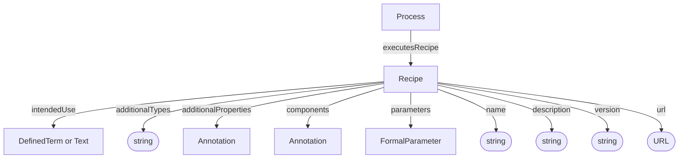

# Recipe

Description of a planned procedure. Recipes define what a Process executes, including intended use, equipment, reagents, and software.

## Properties

| Property | Type | Cardinality | Required | Description |
|----------|------|-------------|----------|-------------|
| `id` | Text | `0..1` | MAY | Optional identifier within an application-defined scope. Implementations that require an internal identifier SHOULD use this field. The domain model does not automatically assign identifiers. |
| `type` | Text | `1` | MUST | `Recipe` |
| `additionalTypes` | Text | `0..*` | MAY | Discriminator for decoration types. |
| `name` | Text | `0..1` | SHOULD | Human-readable title of the recipe |
| `parameters` | [FormalParameter](../shared/FormalParameter.md) | `0..*` | MAY | Prospective parameter slots for values supplied when executing the recipe |
| `description` | Text | `0..1` | SHOULD | Short description or abstract of the planned procedure |
| `intendedUse` | [DefinedTerm](../shared/DefinedTerm.md), Text | `0..1` | SHOULD | Recipe classification, expressed as a controlled vocabulary term or plain text |
| `additionalProperties` | [Annotation](../shared/Annotation.md) | `0..*` | MAY | Extensible recipe metadata not covered by the base properties |
| `components` | [Annotation](../shared/Annotation.md) | `0..*` | MAY | Annotations describing equipment, software, reagents, materials, or other components used in the recipe |
| `version` | Text | `0..1` | MAY | Version identifier of the recipe |
| `url` | URL | `0..1` | MAY | URL of an external resource describing the recipe |

## Relationships

