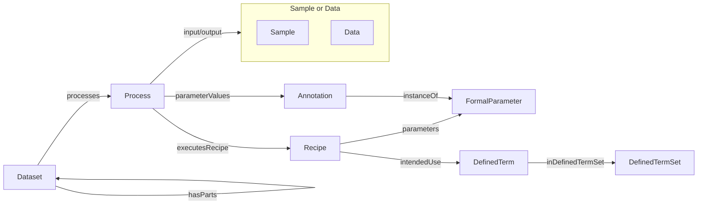

# Process Provenance Profile

The Process Provenance Profile describes the fundamental entities and relationships in the ARC process model. It abstracts experimental and computational workflows as process graphs that connect sample and data inputs to sample and data outputs.

## Entity Specifications

| Type | Description |
|------|-------------|
| [Dataset](Dataset.md) | Container and context for processes, nested datasets, and metadata |
| [Process](Process.md) | Transformation with an optional input and an optional output |
| [Recipe](Recipe.md) | Planned procedure that a process executes |
| [Sample](../shared/Sample.md) | Biological, chemical, or digital sample used as input or output |
| [Data](../shared/Data.md) | Data file or selected file fragment |
| [Annotation](../shared/Annotation.md) | Extensible key-value-unit triple |
| [FormalParameter](FormalParameter.md) | Prospective parameter slot for recipes |
| [DefinedTerm](../shared/DefinedTerm.md) | Ontology annotation or controlled vocabulary term |
| [DefinedTermSet](../shared/DefinedTermSet.md) | Named ontology or controlled vocabulary with an optional identifier |

## Process Graph

The diagram shows the core types and their main relationships. The combined `input/output` connection indicates that either endpoint of a Process can be a Sample or Data object.

