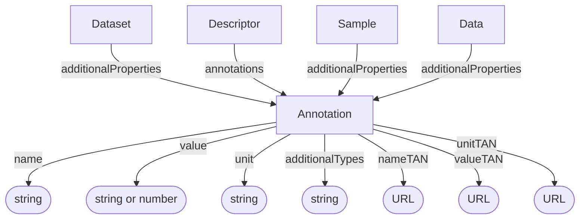

# Annotation

An annotation expresses a semantic assertion as a key, value, unit triple,
represented by `name`, `value`, and `unit`. Each of the three can optionally be
associated with an ontology term through `nameTAN`, `valueTAN`, and `unitTAN`,
respectively. An Annotation can be bundled in a [Descriptor](Descriptor.md) or
attached through `additionalProperties` to a [Dataset](Dataset.md),
[Sample](../shared/Sample.md), or [Data](../shared/Data.md).

This is the same Annotation type described by the [Process Provenance profile](../process_provenance/Annotation.md).

**Schema.org type**: [`PropertyValue`](https://schema.org/PropertyValue)

## Properties

Recommended property mappings are documented in the [schema mapping guide](../../project/schema-mapping.md#semantic-designation).

TAN stands for **term accession number**. The `nameTAN`, `valueTAN`, and `unitTAN` fields contain the URLs of the ontology terms used for the key, value, and unit. The `name` and `unit` fields hold human-readable names.

| Property | Type | Cardinality | Required | Description |
|----------|------|-------------|----------|-------------|
| `id` | Text | `0..1` | MAY | Optional identifier within an application-defined scope. Implementations that require an internal identifier SHOULD use this field. The domain model does not automatically assign identifiers. |
| `type` | Text | `1` | MUST | `Annotation` |
| `additionalTypes` | Text | `1..*` | MUST | MUST include `semantic-designation` as its [base-profile discriminator](../index.md#profile-discriminators). Additional classifications and decoration types MAY also be included. |
| `name` | Text | `1` | MUST | Human-readable name of the annotation's key |
| `value` | Text, Number | `0..1` | SHOULD | Textual or numeric value of the annotation |
| `unit` | Text | `0..1` | SHOULD | Human-readable name of the unit associated with the annotation's value |
| `nameTAN` | URL | `0..1` | SHOULD | URL of the ontology term used for the annotation's key |
| `valueTAN` | URL | `0..1` | MAY | URL of the ontology term used for the annotation's value |
| `unitTAN` | URL | `0..1` | MAY | URL of the ontology term used for the annotation's unit |

## Relationships

