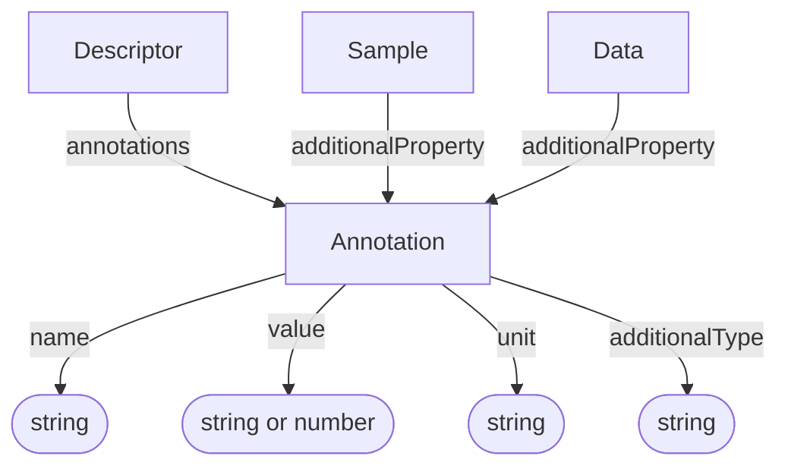

# Annotation

Extensible key-value-unit triple that expresses a semantic assertion. An
Annotation can be bundled in a Descriptor or attached directly to a
[Sample](../process_provenance/Sample.md) or
[Data](../process_provenance/Data.md) entity.

**Schema.org type**: `schema.org/PropertyValue`

## Properties

| Property | Type | Required | Description |
|----------|------|----------|-------------|
| `id` | Text | MUST | Unique identifier for the annotation |
| `type` | Text | MUST | `Annotation` |
| `additionalType` | Text | COULD | Additional semantic type or subtype discriminator |
| `name` | Text | MUST | Key or property name |
| `value` | Text, Number | SHOULD | Asserted value |
| `unit` | Text | COULD | Unit associated with the asserted value |

## Relationships

