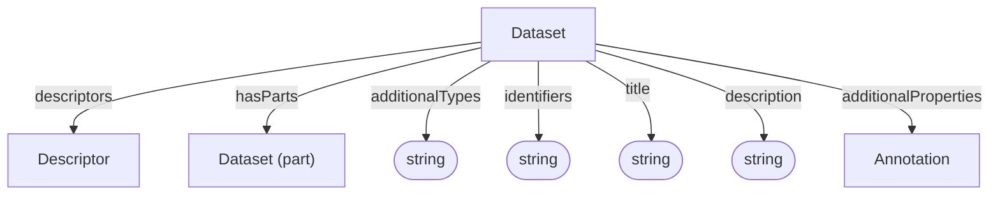

# Dataset

Container for semantic descriptions and nested datasets. A Dataset groups the
descriptors that designate entities represented in an ARC.

This is the same Dataset type described by the [Administrative](../administrative/Dataset.md) and [Process Provenance](../process_provenance/Dataset.md) profiles.

**Schema.org type**: [`Dataset`](https://schema.org/Dataset)

## Properties

Recommended property mappings are documented in the [schema mapping guide](../../project/schema-mapping.md#semantic-designation).

| Property | Type | Cardinality | Required | Description |
|----------|------|-------------|----------|-------------|
| `id` | Text | `0..1` | MAY | Optional identifier within an application-defined scope. Implementations that require an internal identifier SHOULD use this field. The domain model does not automatically assign identifiers. |
| `type` | Text | `1` | MUST | `Dataset` |
| `additionalTypes` | Text | `0..*` | SHOULD | Additional classifications or specializations of the dataset. Discriminator used for decoration types. |
| `identifiers` | Text | `1..*` | MUST | Identifiers by which the dataset is known or referenced, such as a DOI, accession number, repository name, or other identifying string. Identifiers may be globally scoped or scoped to a particular system or context. |
| `title` | Text | `0..1` | SHOULD | Human-readable dataset title |
| `description` | Text | `0..1` | SHOULD | Short description or abstract |
| `descriptors` | [Descriptor](Descriptor.md) | `0..*` | SHOULD | Semantic descriptions associated with the dataset |
| `hasParts` | [Dataset](Dataset.md) | `0..*` | SHOULD | Sub-datasets |
| `additionalProperties` | [Annotation](Annotation.md) | `0..*` | MAY | Extensible metadata |

## Relationships

