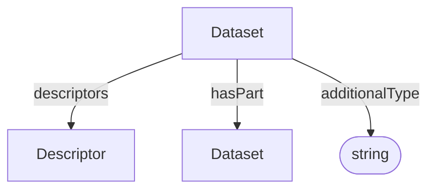

# Dataset

Container for semantic descriptions and nested datasets. A Dataset groups the
descriptors that designate entities represented in an ARC.

**Schema.org type**: `schema.org/Dataset`

## Properties

| Property | Type | Required | Description |
|----------|------|----------|-------------|
| `id` | Text | MUST | Unique identifier for the dataset |
| `type` | Text | MUST | `Dataset` |
| `additionalType` | Text | COULD | Additional semantic type or subtype discriminator |
| `descriptors` | [Descriptor](Descriptor.md) | SHOULD | Semantic descriptions associated with the dataset |
| `hasPart` | [Dataset](Dataset.md) | COULD | Nested datasets that belong to this dataset |

## Relationships

