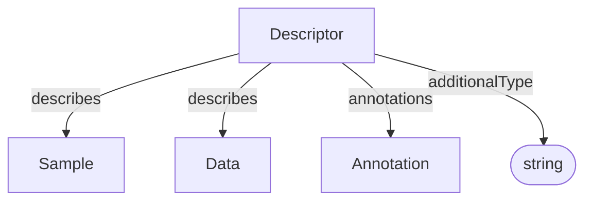

# Descriptor

Bundles multiple assertions into a single semantic description. A Descriptor
identifies the [Sample](../process_provenance/Sample.md) or
[Data](../process_provenance/Data.md) entity it describes and collects the
annotations that provide its semantic meaning.

## Properties

| Property | Type | Required | Description |
|----------|------|----------|-------------|
| `id` | Text | MUST | Unique identifier for the descriptor |
| `type` | Text | MUST | `Descriptor` |
| `additionalType` | Text | COULD | Additional semantic type or subtype discriminator |
| `describes` | [Sample](../process_provenance/Sample.md), [Data](../process_provenance/Data.md) | MUST | Entity designated by this descriptor |
| `annotations` | [Annotation](Annotation.md) | SHOULD | Semantic assertions bundled by this descriptor |

## Relationships

