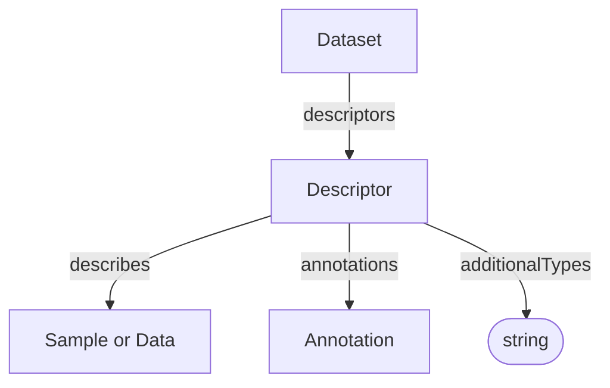

# Descriptor

A semantic description of one [Sample](../shared/Sample.md) or
[Data](../shared/Data.md) entity. A Descriptor collects annotations
that express semantic assertions about that entity.

## Properties

| Property | Type | Cardinality | Required | Description |
|----------|------|-------------|----------|-------------|
| `id` | Text | `0..1` | MAY | Optional identifier within an application-defined scope. Implementations that require an internal identifier SHOULD use this field. The domain model does not automatically assign identifiers. |
| `type` | Text | `1` | MUST | `Descriptor` |
| `additionalTypes` | Text | `0..*` | MAY | Discriminator for decoration types. |
| `describes` | [Sample](../shared/Sample.md), [Data](../shared/Data.md) | `1` | MUST | Sample or data object described by this descriptor |
| `annotations` | [Annotation](../shared/Annotation.md) | `0..*` | SHOULD | Semantic assertions bundled by this descriptor |

## Relationships

