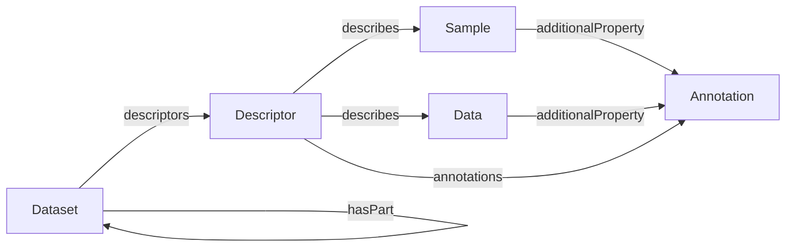

# Semantic Designation Profile

This profile defines a consistent approach for describing semantic metadata associated with entities represented in an ARC. These entities may be data entities, such as directories, files, or fragments of files, as well as contextual entities, such as physical samples, instruments, or other real-world objects represented in the ARC.

## Core Types

| Type | Description |
|------|-------------|
| [Dataset](Dataset.md) | Container and context for processes, nested datasets, data files, and metadata |
| [Descriptor](Descriptor.md) | Bundles multiple assertions into a single semantic description |
| [Sample](../shared/Sample.md) | Biological, chemical, or digital sample used as input or output |
| [Data](../shared/Data.md) | Data file or selected file fragment |
| [Annotation](../shared/Annotation.md) | Extensible key-value-unit triple |

## Process Graph

