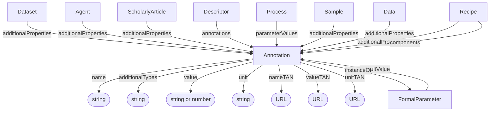

# Annotation

An annotation is a key, value, unit triple, represented by `name`, `value`, and `unit`. Each of the three can optionally be associated with an ontology term through `nameTAN`, `valueTAN`, and `unitTAN`, respectively. Annotation is shared by all three base profiles and carries no required base-profile discriminator.

Annotations can be attached through `additionalProperties` for cross-cutting metadata, bundled in a [Descriptor](../semantic_designation/Descriptor.md) through `annotations`, or used through dedicated relationships such as `parameterValues`, `components`, and `defaultValue`. A parameter-value annotation can optionally link to its formal parameter definition through `instanceOf`.

## Properties

TAN stands for **term accession number**. The `nameTAN`, `valueTAN`, and `unitTAN` fields contain the URLs of the ontology terms used for the key, value, and unit. The `name` and `unit` fields hold human-readable names.

| Property | Type | Cardinality | Required | Description |
|----------|------|-------------|----------|-------------|
| `id` | Text | `0..1` | MAY | Optional identifier within an application-defined scope. Implementations that require an internal identifier SHOULD use this field. The domain model does not automatically assign identifiers. |
| `type` | Text | `1` | MUST | `Annotation` |
| `additionalTypes` | Text | `0..*` | SHOULD | Additional classifications or specializations of the annotation. |
| `name` | Text | `1` | MUST | Human-readable name of the annotation's key |
| `value` | Text, Number | `0..1` | SHOULD | Textual or numeric value of the annotation |
| `unit` | Text | `0..1` | MAY | Human-readable name of the unit associated with the annotation's value |
| `nameTAN` | URL | `0..1` | SHOULD | URL of the ontology term used for the annotation's key |
| `valueTAN` | URL | `0..1` | MAY | URL of the ontology term used for the annotation's value |
| `unitTAN` | URL | `0..1` | MAY | URL of the ontology term used for the annotation's unit |
| `instanceOf` | [FormalParameter](../process_provenance/FormalParameter.md) | `0..1` | MAY | Links a parameter value to its formal parameter definition |

## Relationships

