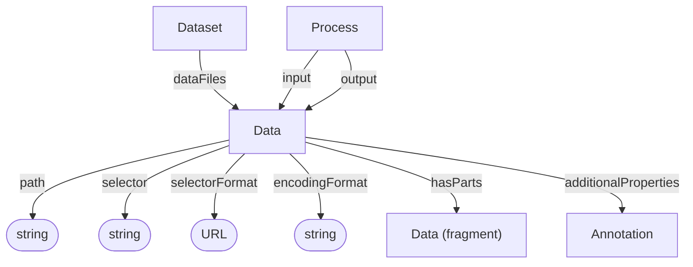

# Data

A data file or a selected fragment of a file. Data objects can be used as process inputs or outputs.

## Properties

| Property | Type | Cardinality | Required | Description |
|----------|------|-------------|----------|-------------|
| `id` | Text | `0..1` | MAY | Optional identifier within an application-defined scope. Implementations that require an internal identifier SHOULD use this field. The domain model does not automatically assign identifiers. |
| `type` | Text | `1` | MUST | `Data` |
| `additionalTypes` | Text | `0..*` | MAY | Additional classifications or specializations of the data object. |
| `path` | Text | `1` | MUST | Path to the target file. Required on every Data object, including nested fragments; an optional `selector` narrows the target to a fragment of that file. |
| `selector` | Text | `0..1` | MAY | Fragment selector that narrows the target to a subset of the data object |
| `selectorFormat` | URL | `0..1` | MAY | URL describing the selector syntax, e.g. RFC 7111 |
| `encodingFormat` | Text | `0..1` | MAY | MIME type of the target data object or fragment |
| `hasParts` | [Data](Data.md) | `0..*` | MAY | Nested fragments of this data object |
| `additionalProperties` | [Annotation](Annotation.md) | `0..*` | MAY | Extensible file-, fragment-, or content-level metadata |

## Relationships

