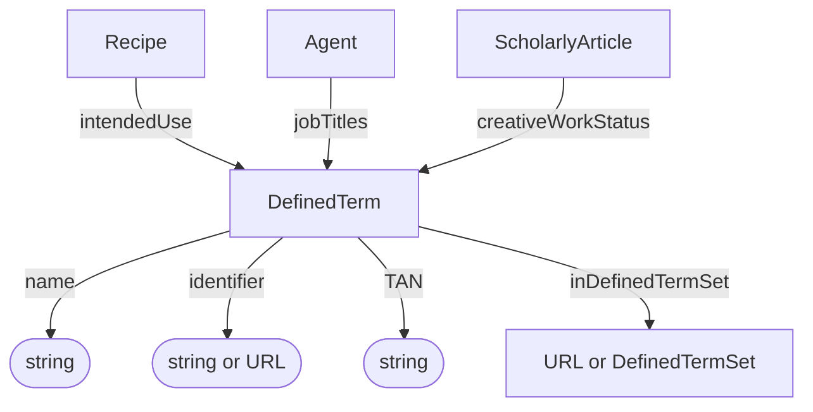

# DefinedTerm

Ontology annotation referencing a term in a controlled vocabulary or ontology.

**Schema.org type**: [`DefinedTerm`](https://schema.org/DefinedTerm)

## Properties

Recommended property mappings are documented in the [schema mapping guide](../../project/schema-mapping.md#process-provenance).

| Property | Type | Cardinality | Required | Description |
|----------|------|-------------|----------|-------------|
| `id` | Text | `0..1` | MAY | Optional identifier within an application-defined scope. Implementations that require an internal identifier SHOULD use this field. The domain model does not automatically assign identifiers. |
| `type` | Text | `1` | MUST | `DefinedTerm` |
| `name` | Text | `1` | MUST | Human-readable name of the term |
| `identifier` | Text, URL | `0..1` | MAY | Identifier of the term, expressed as text or a URL |
| `TAN` | Text | `0..1` | SHOULD | Term accession number identifying the term within the ontology |
| `inDefinedTermSet` | URL, [DefinedTermSet](DefinedTermSet.md) | `0..1` | SHOULD | Ontology or controlled vocabulary containing the term, expressed as a URL or a named term-set object |

## Relationships

