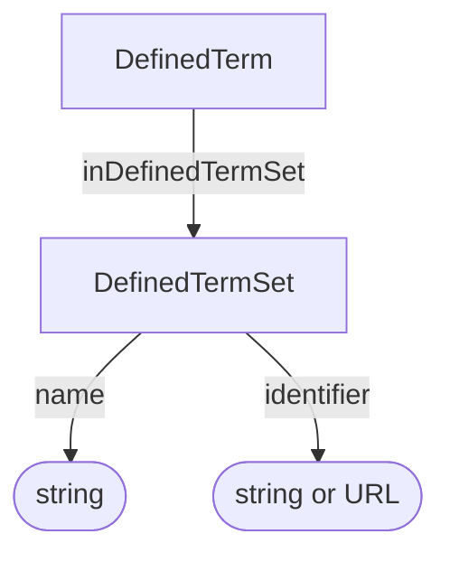

# DefinedTermSet

A named ontology, controlled vocabulary, classification scheme, or other set of defined terms. A DefinedTerm can describe its containing term set through `inDefinedTermSet`.

## Properties

| Property | Type | Cardinality | Required | Description |
|----------|------|-------------|----------|-------------|
| `id` | Text | `0..1` | MAY | Optional identifier within an application-defined scope. Implementations that require an internal identifier SHOULD use this field. The domain model does not automatically assign identifiers. |
| `type` | Text | `1` | MUST | `DefinedTermSet` |
| `name` | Text | `1` | MUST | Human-readable name of the ontology, controlled vocabulary, or other term set |
| `identifier` | Text, URL | `0..1` | MAY | Identifier of the term set, expressed as text or a URL |

## Relationships

