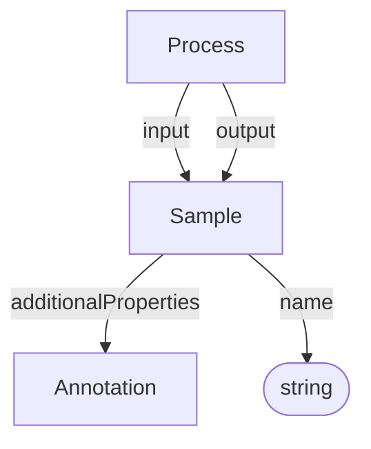

# Sample

Input or output biological, chemical, or digital sample in the process graph. Samples can derive from other samples through processes, forming provenance chains.

## Properties

| Property | Type | Cardinality | Required | Description |
|----------|------|-------------|----------|-------------|
| `id` | Text | `0..1` | MAY | Optional identifier within an application-defined scope. Implementations that require an internal identifier SHOULD use this field. The domain model does not automatically assign identifiers. |
| `type` | Text | `1` | MUST | `Sample` |
| `additionalTypes` | Text | `0..*` | MAY | Additional classifications or specializations of the sample. |
| `name` | Text | `1` | MUST | Human-readable name of the sample |
| `additionalProperties` | [Annotation](Annotation.md) | `0..*` | SHOULD | Characteristics, factors, or other metadata describing the sample |

## Relationships

